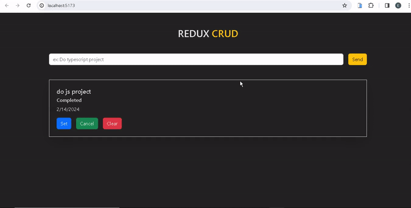

<h1> Redux_Crud </h1>

I've independently designed and coded a responsive Redux_Crud website, and it's ready to explore!

🔸 Project Name: Redux_Crud Website

🔸 Technologies Used: React, Redux Toolkit, React Redux, React Router Dom, Bootstrap, React Bootstrap

🔸 Project Description: This website, which I designed and coded from scratch, works flawlessly on various devices, from mobile phones to desktop computers. CRUD project includes adding, editing and deleting features created with react redux and used json server and react vite library.

🔸 Functions:
- Adding: Users can add new tasks.
- Update: Users can update existing tasks.
- Delete: Users can delete existing tasks.
- Listing: Users can view the tasks they added in a list.

<h2>Screen_Shoot</h2>

